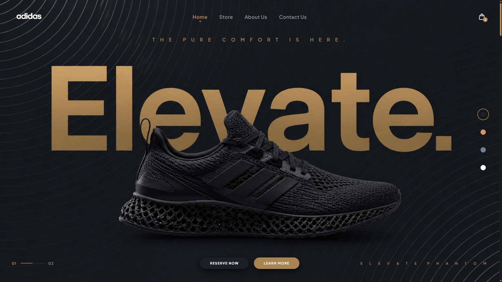

<div align="center">

<picture>
  <source
    media="(prefers-color-scheme: dark)"
    srcset="./assets/logo_svg.svg">
  <source
    media="(prefers-color-scheme: light)"
    srcset="./assets/logo_svg.svg">
  
</picture>

# Adidas Elevate — Interactive Web Experience

An immersive, single-page 3D footwear showcase built for **Adidas Elevate** — featuring dynamic colorway theming, parallax depth effects, and a fully interactive shopping experience, crafted entirely in vanilla HTML, CSS, and JavaScript.


</div>

## 📸 Preview



## 🚀 Features

- **Dynamic Colorway Themes** — Instantly switch between Elevate Phantom, Elevate Dune, Elevate Slate, and Elevate Frost, each with its own accent palette, background art, and hero imagery.
- **3D Parallax & Depth Effects** — Interactive shoe pop-out colorway cards with layered depth shadows and smooth motion for a tactile, premium feel.
- **Video Spotlight** — Autoplaying, muted HTML5 video showcase for the Elevate Phantom colorway.
- **Cinematic Hero Slider** — Auto-advancing slide track with progress indicators and slide numbering for a storefront-style landing experience.
- **Ultra-Responsive Mobile UX** — Dedicated mobile drawer navigation, responsive typography, and glassmorphic UI elements tuned for every screen size.
- **Interactive Modals & Drawer** — VIP pair reservation modal, product info modal with colorway selector, and a fully functional shopping cart drawer with live subtotal.
- **Newsletter & Club Signup** — Modern subscribe form for joining the Elevate club and staying up to date on drops.
- **Bestsellers & Reviews** — Curated bestseller showcase and customer reviews section to build product trust.

## 🛠️ Technology Stack

- **HTML5** — Semantic, accessible markup with native `<video>` for the Phantom colorway spotlight
- **CSS3** — Vanilla design system with glassmorphism, custom properties, and responsive layout
- **Vanilla JavaScript (ES6+)** — Interactive state management and theme engine (no frameworks, no build step)
- **Font Awesome 6.4.0** — Icon system, loaded via cdnjs
- **Google Fonts** — Plus Jakarta Sans, loaded via `fonts.googleapis.com`

## 📁 Project Structure

```
adidas-elevate/
├── index.html          # Main application markup
├── styles.css          # Complete design system & responsive styles
├── script.js           # Theme engine, cart, modals & interactions
└── assets/             # Images, logos, and video assets
```

## 💻 Local Development

No build tools or dependencies required. Simply serve the files with any static HTTP server:

```bash
# Using Python
python3 -m http.server 8080

# Using Node (http-server)
npx http-server

# Or just open index.html directly in your browser
```

Then open `http://localhost:8080` in your browser.

## 📄 License

This project is intended for showcase and portfolio purposes.
